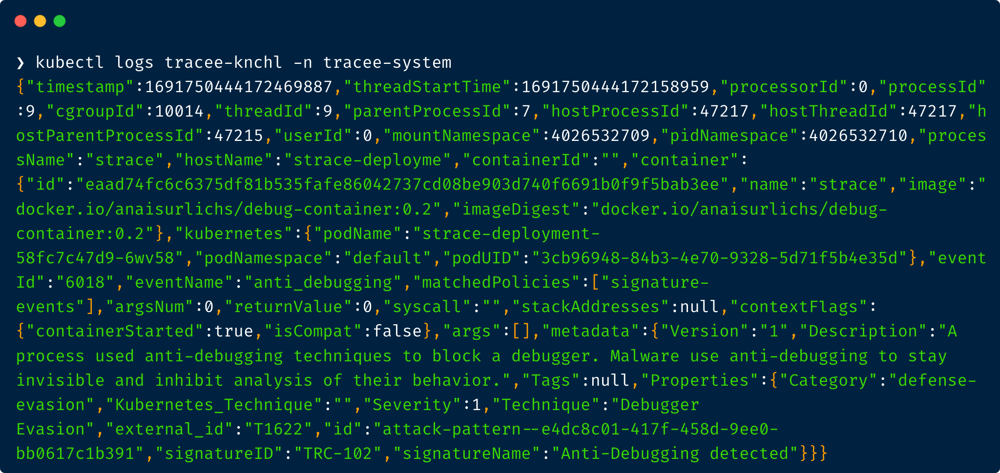

# Tracee: Runtime Security and Forensics using eBPF

Tracee uses eBPF technology to tap into your system and give you access to hundreds of events that help you understand how your system behaves.
In addition to basic observability events about system activity, Tracee adds a collection of sophisticated security events that expose more advanced behavioral patterns. 
Tracee provides a rich filtering mechanism that allows you to eliminate noise and focus on specific workloads that matter most to you.

**Key Features:**
* Kubernetes native installation
* Hundreds of default events
* Ships with a basic set of behavioral signatures for malware detection out of the box 
* Easy configuration through Tracee Policies 
* Kubernetes native user experience that is targetted at cluster administrators

> We release new features and changes on a regular basis. Learn more about the letest release in our [discussions.](https://github.com/aquasecurity/tracee/discussions)

To learn more about Tracee, check out the [documentation](https://aquasecurity.github.io/tracee/latest/docs/overview/). 

## Quickstart

Installation options:
* [Install Tracee in your Kubernetes cluster.](https://aquasecurity.github.io/tracee/latest/getting-started/kubernetes-quickstart)
* [Experiment using the Tracee container image.](https://aquasecurity.github.io/tracee/latest/getting-started/docker-quickstart)

Steps to get started:

1. [Install Tracee in your Kubernetes cluster through Helm](https://aquasecurity.github.io/tracee/latest/getting-started/kubernetes-quickstart/)
2. Query logs to see detected events

Next, try one of our tutorials:

3. Filter events through [Tracee Policies](https://aquasecurity.github.io/tracee/latest/tutorials/k8s-policies/) 
4. [Manage logs through Grafana Loki](https://aquasecurity.github.io/tracee/latest/tutorials/promtail/) or your preferred monitoring solution

Example log output in Tracee pod
## Contributing
  
Join the community, and talk to us about any matter in the [GitHub Discussions](https://github.com/aquasecurity/tracee/discussions) or [Slack](https://slack.aquasec.com).  
If you run into any trouble using Tracee or you would like to give use user feedback, please [create an issue.](https://github.com/aquasecurity/tracee/issues)

Find more information on [contributing to the source code](https://aquasecurity.github.io/tracee/latest/contributing/overview/) in the documentation.

Please consider giving us a star ⭐️
by clicking the button at the top of the [GitHub page](https://github.com/aquasecurity/tracee/)

## More about Aqua Security

Tracee is an [Aqua Security](https://aquasec.com) open source project.  
Learn about our open source work and portfolio [here](https://www.aquasec.com/products/open-source-projects/).
