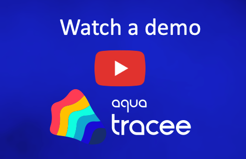

[](https://github.com/aquasecurity/tracee/releases)
[](https://goreportcard.com/report/github.com/aquasecurity/tracee)
[](https://github.com/aquasecurity/tracee/blob/main/LICENSE)
[](https://hub.docker.com/r/aquasec/tracee)
[](https://github.com/aquasecurity/tracee/actions/workflows/release-snapshot.yaml)
[](https://github.com/aquasecurity/tracee/actions/workflows/test-os-packaging-daily.yaml)
[](https://github.com/aquasecurity/tracee/actions/workflows/test-daily.yaml)

# Tracee: Runtime Security and Forensics using eBPF

Tracee is a Runtime Security and forensics tool for Linux. It uses Linux **eBPF
technology** to trace your system and applications **at runtime**, and analyzes
collected events in order to detect **suspicious behavioral patterns**. It is
usually delivered as a docker container, but there are other ways you can use
it (even create your own customized tracee container).

Watch a quick video demo of Tracee:

[](https://youtu.be/x2_iF0KjPKs?t=2971)

Check out the [Tracee video hub](https://info.aquasec.com/ebpf-runtime-security) for more videos.

## Documentation

The full documentation of Tracee is available at
[https://aquasecurity.github.io/tracee/dev](https://aquasecurity.github.io/tracee/dev).
You can use the version selector on top to view documentation for a specific
version of Tracee.

## Quickstart

Before you proceed, make sure you follow the [minimum requirements for running Tracee](./docs/installing/prerequisites.md).

1. Running **tracee:latest**

  ```text
  docker run \
    --name tracee --rm -it \
    --pid=host --cgroupns=host --privileged \
    -v /etc/os-release:/etc/os-release-host:ro \
    -e LIBBPFGO_OSRELEASE_FILE=/etc/os-release-host \
    aquasec/tracee:latest
  ```

2. Running **tracee:full**

  ```text
  docker run --name tracee --rm -it \
    --pid=host --cgroupns=host --privileged \
    -v /etc/os-release:/etc/os-release-host:ro \
    -e LIBBPFGO_OSRELEASE_FILE=/etc/os-release-host \
    -v /usr/src:/usr/src:ro \
    -v /lib/modules:/lib/modules:ro \
    -v /tmp/tracee:/tmp/tracee:rw \
    aquasec/tracee:full
  ```

> 1. The default (latest) image is **lightweight** and **portable**. It is
>    supposed to support different kernel versions without having to build
>    source code. If the host kernel does not support BTF then you may use the
>    **full** container image. The full container will compile an eBPF object
>    during startup, if you do not have one already cached in
>    /tmp/tracee.
>
> 2. You may need to change the volume mounts for the kernel headers based on
>    your setup. See [Linux Headers](./docs/installing/headers.md) section for
>    more info.
>
> 3. Tracee supports enriching events with additional data from running
>    containers. In order to enable this capability please look
>    [here](./docs/integrating/container-engines.md).

These docker commands run Tracee with **default settings** and start
**reporting detections** to **standard output**. In order to simulate a
suspicious behavior, you can simply run:

```
strace ls
```

in another terminal. This will trigger the **Anti-Debugging** signature, which
is loaded by default, and you will get a warning:

```
INFO: probing tracee-ebpf capabilities...
INFO: starting tracee-ebpf...
INFO: starting tracee-rules...
Loaded 14 signature(s): [TRC-1 TRC-13 TRC-2 TRC-14 TRC-3 TRC-11 TRC-9 TRC-4 TRC-5 TRC-12 TRC-8 TRC-6 TRC-10 TRC-7]
Serving metrics endpoint at :3366
Serving metrics endpoint at :4466

*** Detection ***
Time: 2022-03-25T08:04:22Z
Signature ID: TRC-2
Signature: Anti-Debugging
Data: map[]
Command: strace
Hostname: ubuntu-impish
```

## Trace

In some cases, you might want to **leverage Tracee's eBPF event collection
capabilities** directly, without involving the **detection engine**. This might
be useful for debugging, troubleshooting, analysing, researching OR
education.

Execute docker container with the word `trace` as an initial argument, and
**tracee-ebpf** will be executed, instead of the full tracee detection engine.

```text
docker run \
  --name tracee --rm -it \
  --pid=host --cgroupns=host --privileged \
  -v /etc/os-release:/etc/os-release-host:ro \
  -e LIBBPFGO_OSRELEASE_FILE=/etc/os-release-host \
  aquasec/tracee:latest \
  trace
```

> See documentation or add the `--help` flag for more.

## Components

Tracee is composed of the following sub-projects, which are hosted in the
aquasecurity/tracee repository:

- [Tracee-eBPF] - Linux Tracing and Forensics using eBPF
- [Tracee-Rules] - Runtime Security Detection Engine

---

Tracee is an [Aqua Security] open source project.
Learn about our open source work and portfolio [Here].
Join the community, and talk to us about any matter in [GitHub Discussion] or [Slack].

[Tracee-eBPF]: https://github.com/aquasecurity/tracee/tree/main/cmd/tracee-ebpf
[Tracee-Rules]: https://github.com/aquasecurity/tracee/tree/main/cmd/tracee-rules

[Aqua Security]: https://aquasec.com
[GitHub Discussion]: https://github.com/aquasecurity/tracee/discussions
[Slack]: https://slack.aquasec.com
[Here]: https://www.aquasec.com/products/open-source-projects/
