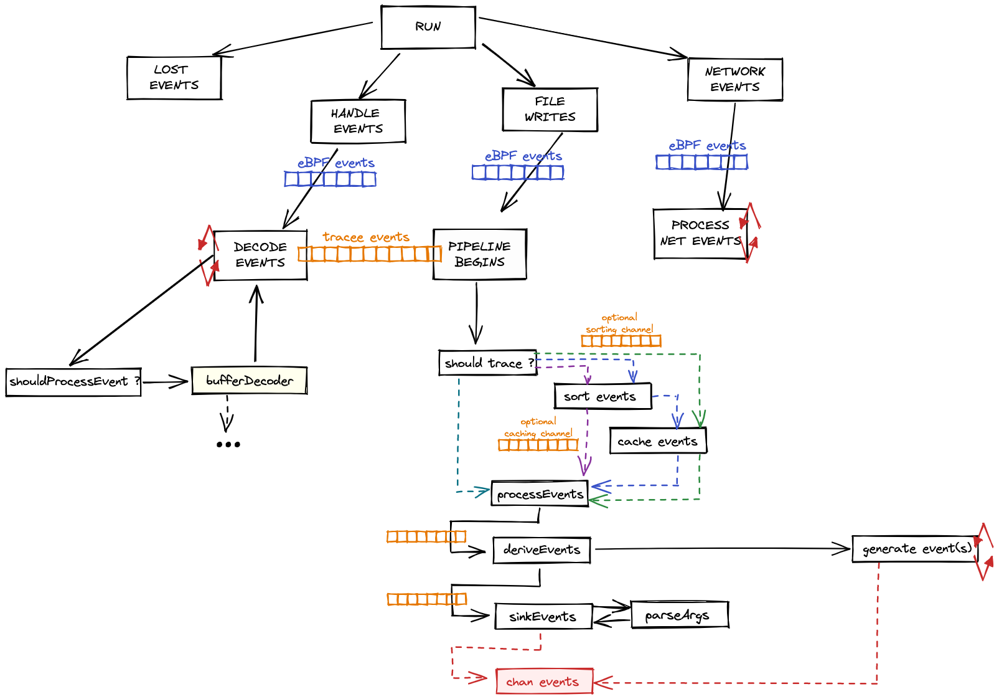

# Architecture

## Tracee Architecture Overview

!!! Overview Note

    1. Kernel eBPF programs **GENERATE** Tracee Events to Userland:
        1. Tracepoints
        1. Probes
        1. Trafic Control Hooks
    
    1. Userland events are **[COLLECTED] and ENRICHED** with more information:
        1. Kernel Events (Syscalls, Tracepoints, Kprobes)
        1. OS Events (Running Containers, ...)
        1. Derived (from other) Events
        1. Network Events
    
    [COLLECTED]:./tracing/index.md
    
    1. **[DETECT]** patterns based on existing signatures:
        1. [OPA/Rego signatures](https://github.com/open-policy-agent/opa)
        1. [Golang signatures](https://github.com/aquasecurity/tracee/blob/{{ git.tag[1:] }}/signatures/golang/examples/example.go)
        1. [Go-CEL signatures](https://github.com/google/cel-go/) (tech-preview/experimental)
    
    [DETECT]: ./detecting/index.md
    
    1. Let other tools to **CONSUME** detection events:
        1. [Capture Artifacts](./capturing/index.md)
        1. [Postee](https://github.com/aquasecurity/postee)
        1. [Falco Sidekick](https://github.com/falcosecurity/falcosidekick)
    
    1. **ENFORCE**
        1. Work in Progress

## Tracee Pipeline Concept

!!! Pipeline Warning

    1. Multiple CPUs constantly generate events from the eBPF programs running
       inside the kernel (inside an eBPF VM).
    
    1. The eBPF programs are executed whenever the kernel (or network) hooks
       they're attached to are triggered.
    
    1. eBPF programs decide whether they should submit the events to
       **tracee-ebpf** or not, based on given filters.
    
    1. Those events are sent to **libbpfgo** through a shared memory ring buffer
       mechanism (called **perfbuffer**).
    
    1. **libbpfgo** sends collected events to tracee through **golang
       channels**.
    
    1. **tracee-ebpf** parses received events and does multiple things:
    
        1. parse events for argument type conversions if requested
        1. enriches the events that need enrichment (containers, network, processes)
        1. capture artifacts from collected events into external files
    
    1. **tracee-ebpf** writes events to **tracee-rules** through a mechanism
       called **printer**.
    
    1. **tracee-rules** receives events and evaluate them using either golang
       or rego (or go-cel, as a proof-of-concept) signatures.
    
        1. Golang signatures are faster and do pretty much anything the language
           allows. They might connect (or have cached) external data sources to
           evaluate events, for example.
    
    1. Detections are spit out from **tracee-rules** if evaluations are
       positive.
    
    > This mechanism is what we call the **tracee pipeline**: to receive events
    > from the kernel into userland (**tracee-ebpf**), then to parse and enrich
    > those events and to submit them to **tracee-rules** for it to evaluate
    > them looking for detection patterns described as **signatures**.

