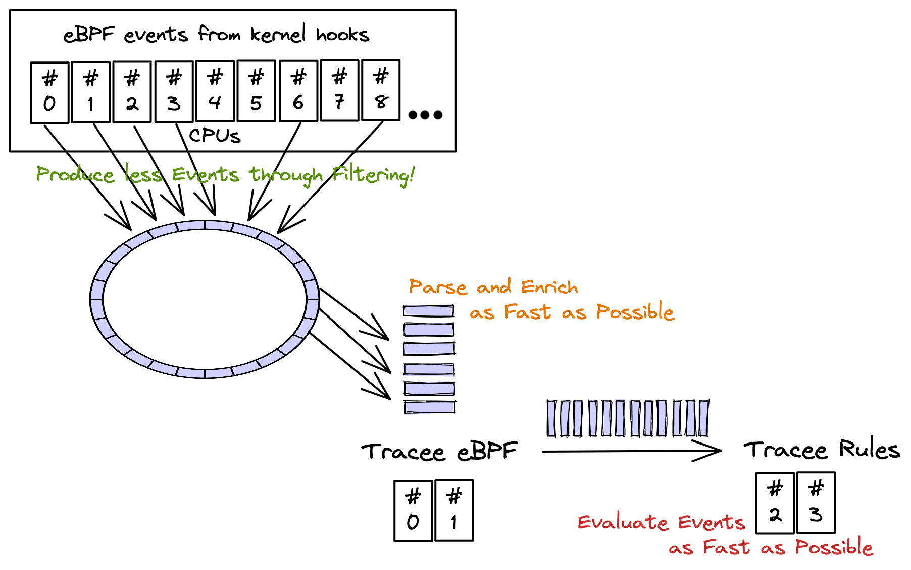

# Special: Performance

!!! Read Important
    Before continuing, please read the [architecture page], in order to
    understand the [tracee pipeline] concept.

[architecture page]: ./architecture.md
[tracee pipeline]: ./architecture.md#tracee-pipeline-concept



## Pain Points

From the **tracee** pipeline concept page, you learned that there might be
**2 pain points** regarding **tracee** performance:

1. Path between **kernel** and **tracee-ebpf** (through perfbuffers + golang
   channels)

    1. The only way to reduce the amount of events to userland is by bringing
       all filters into eBPF programs. There are some problems by doing that:
       the eBPF programs can't be too big, or too slow, not to impact the
       **kernel** performance (one of the reasons why eBPF virtual machine
       exists: to sandbox eBPF code).

2. Path between **tracee-ebpf** and **tracee-rules** (currently: a pipe,
   future: a channel)

    1. Processing, parsing and enriching events in userland needs to be
       unblocking AND as fast as possible. Any extra processing in
       **tracee-ebpf** might delay the delivery of events from the **kernel**
       all the way down to **tracee-rules** signatures.

    2. The communication in between **tracee-ebpf** and **tracee-rules** needs
       to be fast and not to block the consumption of events coming from the
       **kernel**. If this is blocked, then **tracee** will start loosing
       events because it can't catch up with the speed the events are being
       created in **kernel**.

    3. **tracee-rules** processing needs to be as fast as possible. Taking too
       long to evaluate a detection from each received event will slow down the
       consumption of the pipe in between **tracee-ebpf** and **tracee-rules**,
       delaying also the path in between the **kernel** and **tracee-ebpf**.

## Addressing Pain Points

1. Path in between **kernel** and **tracee-ebpf**:

    1. eBPF programs already do filtering in-kernel but not for all
       possible filter inputs (this is being improved for next releases).

2. Path in between **tracee-ebpf** and **tracee-rules**:

    1. From measurements, the pipe used in between **tracee-ebpf** and
       **tracee-rules** processes is NOT a bottleneck BUT the **gob** output
       format (input format for **tracee-rules**) has better performance.

    2. The signatures processing might be a bottleneck. Using golang signatures
       in **tracee-rules**, for evaluating detections, has **bigger
       performance** and should be considered whenever possible.

## Test Concepts

Example using container **enrichment** in the pipeline, argument **parsing** so
arguments are formatted in a human consumable way, **detecting** syscall that
generated the event:

```text
$ sudo ./dist/tracee-ebpf \
    --containers -o format:json \
    -o option:parse-arguments \
    -trace container \
    --crs docker:/var/run/docker.sock
```

> We are using most of the options that could cause latencies in the event
> pipeline BUT we're not piping the events to **tracee-rules**.

!!! Attention
    If you pipe **tracee-ebpf** output to another tool, like `jq`:
    ```text
    | jq -c '. | {cgroupid, processname, containername}'
    ```
    You may cause latencies in **tracee-ebpf** pipeline because the event json
    processing from `jq` might not be as fast as how **tracee-ebpf** is capable
    of writing events to it (just like **tracee-rules** could do if being slow
    evaluating events).
