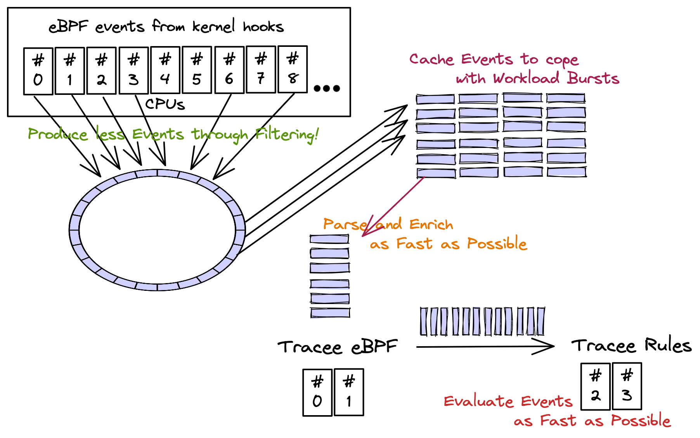

# Special: Caching Events

Tracee has an events caching (in-memory) mechanism. In order to check latest
caching options you may execute:

```console
./dist/tracee man cache
```

<!-- TODO: reference the architecture page again-->



The caching happens in userland, it is an in-memory caching, and it helps with
workload bursts: if kernel produces more events than userland is capable of
processing then the events are kept in a sizeable cache (defined by user) so
they're not lost (if cache isn't full).

The effects of this are the following:

1. Detections **might be delayed** because of workload bursts, but not lost (if
   cache isn't full).

2. Event losses from the kernel perf/ring buffer will only happen when
   **cache is full**.

3. Any difference in ratio production:consumption can be mitigated temporarily.

## Use caching

Example using **1GB cache**:

```console
sudo ./dist/tracee \
    --cache cache-type=mem \
    --cache mem-cache-size=1024 \
    -o format:json \
    -o option:parse-arguments \
    -trace container \
    --cri docker:/var/run/docker.sock
```

!!! Attention
    If you pipe **tracee** output to another tool, like `jq`:
    ```console
    | jq -c '. | {cgroupid, processname, containername}'
    ```
    You may cause latencies in **tracee** pipeline because the event json
    processing from `jq` might not be as fast as how **tracee** is capable of
    writing events to it.
