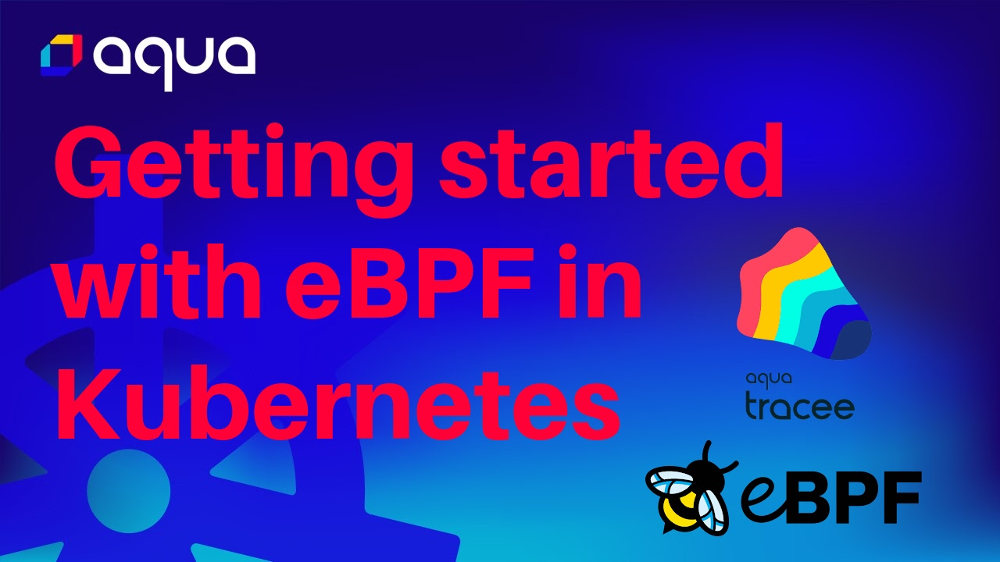

# Installing Tracee in Kubernetes 

This guide will help you get started with Tracee by installing it in a Kubernetes cluster.  


## Prerequisites

- Supported environment - please refer to the [Prerequisites](../install/prerequisites.md)
- Kubernetes - this was tested on [minikube](https://github.com/kubernetes/minikube), but should work the same with most other Kubernetes distributions
- [Helm](https://helm.sh/docs/intro/install/)

<details>
  <summary>Verify step</summary>
```console
kubectl get po -A
```

```text
NAMESPACE     NAME                               READY   STATUS    RESTARTS   AGE 
kube-system   coredns-565d847f94-kd9xx           1/1     Running   0          15s 
kube-system   etcd-minikube                      1/1     Running   0          26s 
kube-system   kube-apiserver-minikube            1/1     Running   0          26s 
kube-system   kube-controller-manager-minikube   1/1     Running   0          26s 
kube-system   kube-proxy-cvqjm                   1/1     Running   0          15s 
kube-system   kube-scheduler-minikube            1/1     Running   0          26s 
kube-system   storage-provisioner                1/1     Running   0          15s 
```
</details>

## Install Tracee

The provided Helm chart will install Tracee as a DaemonSet so that it's tracing all the nodes in the cluster.

```console
helm repo add aqua https://aquasecurity.github.io/helm-charts/
helm repo update
helm install tracee aqua/tracee --namespace tracee --create-namespace
```

<details>
  <summary>Verify step</summary>
```console
kubectl get pods -n tracee
```

```text
NAME           READY   STATUS    RESTARTS   AGE 
tracee-fcjmp   1/1     Running   0          4m11s
```
</details>

Once installed, Tracee immediately starts producing events. Since Tracee is deployed as a DaemonSet, a Tracee Pod is running on every node in the cluster. Every Tracee Pod is monitoring the node it is running on.

## Viewing Events

The easiest way to tap into the log stream of all Tracee Pods is with the `kubectl logs` command:

```console
kubectl logs -f daemonset/tracee -n tracee
```

!!! Note
    Tracee can produce a very high volume of events which could overwhelm kubectl's log collection command. If run in a busy cluster or with a verbose policy, this command might be slow or unresponsive.

In production scenario you would probably want to collect and ship events logs into a persistent storage that you can query.   
You can use any log collection solution of your choosing. We have a tutorial on how to do this using the open source Grafana Stack [here](../../tutorials/deploy-grafana-dashboard.md).

## Applying Policies

By default, Tracee collects a basic set of events that gives you a general overview of the cluster. If you're looking to do more with Tracee, You might want to create a new [Policy](../policies/index.md). A policy lets you capture specific set of events from a specific set of workloads. For example, if you have an application that you want to monitor more closely, or in a specialized way, you can create a policy scoped to that application, with a different set of events and filters applied. To learn more, please refer to the [Events](../events/index.md) and [Policies](../policies/index.md) sections.

When you are ready to apply a policy, it's as easy as `kubectl apply -f your-policy.yaml`. More details [here](../policies/usage/kubernetes.md).

## Configuring Tracee

In some cases you will need to configure Tracee to your preferences. For example, to change the output event format, or to set a different log level. To learn more about available configuration options please see the [configuration](../install/config/index.md) section.

Tracee's configuration is accessible as a ConfigMap in Kubernetes. Since we installed Tracee with Helm, you can also configure Tracee with it, for example: `helm upgrade tracee --set config.cache.size=1024`. More details [here](../install/config/kubernetes.md).

## Optional: Exercising a security event

To see Tracee in action, let's simulate a security event. We'll do a "file-less" execution, which is a common evasion technique used by some malware, and is flagged by Tracee as suspicious activity. To simulate this, we'll use the [tracee-tester](https://registry.hub.docker.com/r/aquasec/tracee-tester) example image it will simulate the suspicious activity without harming your environment.

```console
kubectl run tracee-tester --image=aquasec/tracee-tester -- TRC-105
```

You can see the event in the logs:

```console
kubectl logs -f ds/tracee -n tracee | grep fileless_execution 
```

## Next steps

Familiarize with the different events, filters, and configuration options in the [documentation](../overview.md).

Read other [tutorials](../../tutorials/overview.md).

For help and support, feel free to use [GitHub Discussions](https://github.com/aquasecurity/tracee/discussions).


## Video Content

If you prefer a video version of the Kubernetes installation guide, have a look at the following video:

Getting started with eBPF in Kubernetes - Tracee Installation Guide 

[](https://youtu.be/YQdEvf2IS9k?si=LhQM0CI8_QKvOCeK)
