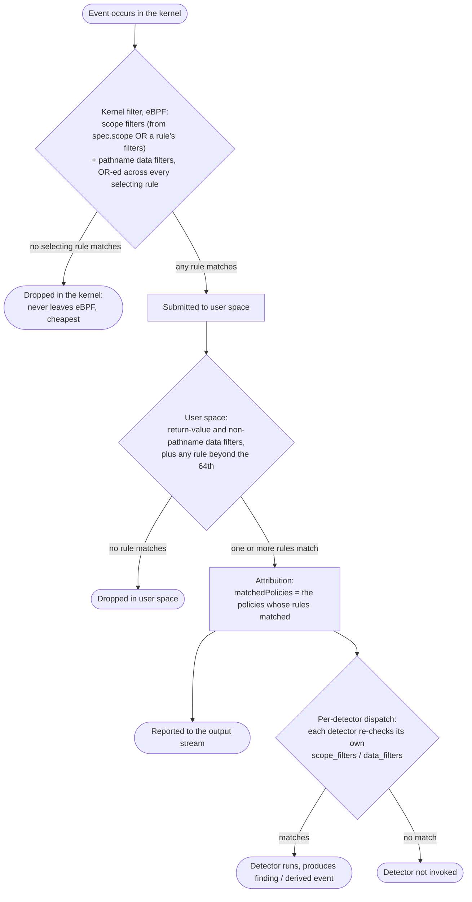

# Rules

Rules are part of the Tracee Policy, `rules` let you define which events to trace.

`rules` have 2 sections: 

- events: let you define which events you want to trace.
- filters: enable you to refine the policy's scope.

Tracee supports many kinds of events to trace. You can find which events you can trace in the [Events section](../events/index.md).

- **NOTE:** It is possible to define multiple events within each policy.

Below is an example showcasing a policy:
```yaml
apiVersion: tracee.aquasec.com/v1beta1
kind: Policy
metadata:
  name: sample-scope-filter
  annotations:
    description: sample scope filter
spec:
  scope:
    - global
  rules:
    - event: openat
      filters:
        - uid=1000
```
## Events

### Type of Events
The value of an `event` is the event name from the supported events.

For example: `syscall` event would be the `syscall` event name.

The [events](../events/index.md) section provides further information on the type of events that Tracee can trace.

### Threat-Based Detector Selection

Instead of specifying individual detector event names, you can select multiple detectors based on their threat metadata properties. This is especially useful for:

- Enabling all high-severity detectors without knowing their names
- Selecting detectors by MITRE ATT&CK framework categories
- Filtering by threat characteristics

#### Selecting by Severity

Select detectors based on their severity level (info, low, medium, high, critical):

```yaml
apiVersion: tracee.aquasec.com/v1beta1
kind: Policy
metadata:
  name: critical-threats-only
  annotations:
    description: Enable all critical severity detectors
spec:
  scope:
    - global
  rules:
    - event: threat.severity=critical
```

You can also use comparison operators:

```yaml
rules:
  - event: threat.severity>=high  # Enable high and critical threats
```

#### Selecting by MITRE ATT&CK

Select detectors by MITRE ATT&CK technique or tactic:

```yaml
apiVersion: tracee.aquasec.com/v1beta1
kind: Policy
metadata:
  name: process-injection-detectors
  annotations:
    description: Enable all process injection detectors
spec:
  scope:
    - global
  rules:
    - event: threat.mitre.technique=T1055
```

Or by tactic:

```yaml
rules:
  - event: threat.mitre.tactic=Defense Evasion
```

#### Selecting by Threat Name

Select detectors by exact threat name:

```yaml
rules:
  - event: threat.name=process_injection
```

#### Selecting by Detector Tags

Detectors can be categorized with tags. Select all detectors with a specific tag:

```yaml
rules:
  - event: containers        # All detectors with "containers" tag
  - event: malware          # All detectors with "malware" tag
```

#### Combining with Regular Events

Threat-based selection can be combined with regular event selection:

```yaml
apiVersion: tracee.aquasec.com/v1beta1
kind: Policy
metadata:
  name: mixed-events
  annotations:
    description: Trace specific events and all critical threats
spec:
  scope:
    - global
  rules:
    - event: security_file_open
      filters:
        - data.pathname=/etc/*
    - event: threat.severity=critical
```

#### Available Threat Properties

| Property | Description | Example Values | Operators |
|----------|-------------|----------------|-----------|
| `threat.severity` | Severity level | info, low, medium, high, critical (or 0-4) | =, !=, <, >, <=, >= |
| `threat.mitre.technique` | MITRE technique ID | T1055, T1071 | =, != |
| `threat.mitre.tactic` | MITRE tactic name | Defense Evasion, Execution | =, != |
| `threat.name` | Threat identifier | process_injection | =, != |

**Note:** Detector selection based on threat properties is performed once when Tracee starts. Matching detectors are enabled; non-matching detectors are never loaded. Multiple rules in a policy are combined with OR logic.


## Filters

Filters enable you to refine the policy's scope by specifying conditions for particular events. This allows you to narrow down the criteria to precisely target the events you're interested in, ensuring that the policy applies only under specific circumstances.

Every `event` that is specified within the `rules` section supports three types of filters: `scope`, `data` and `return value`.

### Scope filters

Further refinement of the policy's scope is achievable through the application of scope filters:

```yaml
apiVersion: tracee.aquasec.com/v1beta1
kind: Policy
metadata:
  name: sample-scope-filter
  annotations:
    description: sample scope filter
spec:
  scope:
    - global
  rules:
    - event: sched_process_exec
      filters:
        - pid=1000
```

The scope filters supported are:

#### p, pid, processId

```yaml
event: sched_process_exec
filters:
    - pid=1000
```

#### tid, threadId

```yaml
event: sched_process_exec
filters:
    - tid=13819
```

#### ppid, parentProcessId

```yaml
event: sched_process_exec
filters:
    - ppid=1000
```

#### hostTid, hostThreadId

```yaml
event: sched_process_exec
filters:
    - hostTid=1000
```

#### hostPid

```yaml
event: sched_process_exec
filters:
    - hostPid=1000
```

#### hostParentProcessId

```yaml
event: sched_process_exec
filters:
    - hostParentProcessId=1
```

#### uid, userId

```yaml
event: sched_process_exec
filters:
    - uid=0
```

#### mntns, mountNamespace

```yaml
event: sched_process_exec
filters:
    - mntns=4026531840
```

#### pidns, pidNamespace

```yaml
event: sched_process_exec
filters:
    - pidns=4026531836
```

#### comm, processName

```yaml
event: sched_process_exec
filters:
    - comm=uname
```

#### hostName

```yaml
event: sched_process_exec
filters:
    - hostName=hostname
```

#### cgroupId

```yaml
event: sched_process_exec
filters:
    - cgroupId=5247
```

#### container

```yaml
event: sched_process_exec
filters:
    - container=66c2778945e29dfd36532d63c38c2ce4ed1
```

#### containerId

```yaml
event: sched_process_exec
filters:
    - containerId=66c2778945e29dfd36532d63c38c2ce4ed1
```

#### containerImage

```yaml
event: sched_process_exec
filters:
    - containerImage=ubuntu:latest
```

#### containerName  

```yaml
event: sched_process_exec
filters:
    - containerName=test
```

#### podName

```yaml
event: sched_process_exec
filters:
    - podName=daemonset/test
```

#### podNamespace

```yaml
event: sched_process_exec
filters:
    - podNamespace=production
```

#### podUid

```yaml
event: sched_process_exec
filters:
    - podUid=66c2778945e29dfd36532d63c38c2ce4ed16a002c44cb254b8e
```

        
### Data filter

Events contain data that can be filtered.

```yaml
apiVersion: tracee.aquasec.com/v1beta1
kind: Policy
metadata:
  name: sample-data-filter
  annotations:
    description: sample data filter
spec:
  scope:
    - global
  rules:
    - event: security_file_open
      filters:
        - data.pathname=/tmp*
```

Data fields can be found on the respective event definition, in this case [security_file_open](https://github.com/aquasecurity/tracee/blob/656eb976fbb66aba54c5f306019258e436d4814a/pkg/events/core.go#L11502-L11533) - be aware of possible changes to the definition linked above, so always check the main branch.

 Or the user can test the event output in CLI before defining a policy, e.g:

```console
tracee -e security_file_open --output json
```

```json
{"timestamp":1680182976364916505,"threadStartTime":1680179107675006774,"processorId":0,"processId":676,"cgroupId":5247,"threadId":676,"parentProcessId":1,"hostProcessId":676,"hostThreadId":676,"hostParentProcessId":1,"userId":131,"mountNamespace":4026532574,"pidNamespace":4026531836,"processName":"systemd-oomd","hostName":"josedonizetti-x","container":{},"kubernetes":{},"eventId":"730","eventName":"security_file_open","matchedPolicies":[""],"argsNum":6,"returnValue":0,"syscall":"openat","stackAddresses":null,"contextFlags":{"containerStarted":false,"isCompat":false},"args":[{"name":"pathname","type":"const char*","value":"/proc/meminfo"},{"name":"flags","type":"string","value":"O_RDONLY|O_LARGEFILE"},{"name":"dev","type":"dev_t","value":45},{"name":"inode","type":"unsigned long","value":4026532041},{"name":"ctime","type":"unsigned long","value":1680179108391999988},{"name":"syscall_pathname","type":"const char*","value":"/proc/meminfo"}]}
```

### Return value filter

Return values can also be filtered.

```yaml
apiVersion: tracee.aquasec.com/v1beta1
kind: Policy
metadata:
  name: sample-return-value
  annotations:
    description: sample return value
spec:
  scope:
    - global
  rules:
    - event: close
      filters:
        - retval!=0
```

## The filtering pipeline (where each filter runs)

A selected event passes through up to three filtering stages before it reaches your output.
Knowing where each filter runs explains both *what gets reported* and *how much work Tracee can
push into the kernel*:



Stage 1 (kernel) is a **union across all rules** that select the event: the kernel submits an
instance if *any* selecting rule's kernel-side filters match (detailed in the next section).
Stages 2 and 3 are **per rule** and **per detector**, so they always narrow precisely regardless
of what other policies do.

Scope filters run in the **kernel** whether you write them at policy level (`spec.scope`) or inside a
single rule's `filters:`, for the common workload dimensions: `comm`, `uid`, `pid`, `mntns`, `pidns`,
`container`, and `executable`. Where you write one changes *what it applies to* — the whole policy
versus that one event — not *where it runs*.

A few less common scope keys are kernel-enforced only from `spec.scope`; written inside a rule's
`filters:` they still narrow correctly but in **user space** (the event is submitted, then filtered):

- `uts` (hostName) — usually redundant with `container`/`mntns`.
- `tree` — a "process and its descendants" scope, meaningful for a whole policy rather than one event.
- a **specific** container id (`containerId`/`containerName`) — a container name/id has to be resolved
  to a kernel identifier when the policy loads, and scoping a *whole policy* to one container is the
  natural way to express "only this container," so per-event kernel enforcement isn't provided for it.
  The `container` boolean above (any container) *is* kernel-enforced per rule.

If you need one of these enforced in the kernel, put it in the policy's `spec.scope`.

### Where each filter is enforced

| Filter | Written as | Enforced in |
|--------|-----------|-------------|
| Scope filters | `uid`, `pid`, `comm`, `mntns`, `pidns`, `uts`, `cgroupId`, `container`, `tree` | **Kernel** (workload-level; always pushed to eBPF) |
| Data filter on a path field | `data.pathname=/tmp*` (exact / prefix / suffix) | **Kernel** (longest-prefix maps) |
| Data filter on any other field | `data.flags=...`, `data.exit_code=0`, ... | **User space** |
| Return-value filter | `retval!=0` | **User space** |

A kernel-enforced filter can drop non-matching instances before they ever leave eBPF (stage 1) —
the cheapest possible filtering. A user-space filter still narrows correctly, but only after the
event has been submitted, so it saves downstream work rather than kernel submission.

!!! note "Many rules on one event (more than 64)"
    The kernel tracks which rules matched an event in a single 64-bit value. When one event is
    selected by **more than 64 rules** (counting every policy and detector that selects it), the
    kernel can no longer represent them all, so it **submits every instance of that event** and
    lets user space match the rules beyond the 64th. Reporting stays correct, but the in-kernel
    reduction for that event is lost. This is uncommon, but worth knowing for very large policy
    sets.

## How filters compose across policies (performance)

Tracee runs every policy against one shared kernel event stream. For a given event,
the kernel collects an instance when it matches the filters of **any** rule that selects
that event — across **all** loaded policies (and any detector that depends on the event).
Filters on the same event therefore compose as a **union (OR)** in the kernel: an instance
is dropped in-kernel only when it fails *every* selecting rule's filters.

This is worth designing policies around, because it decides how much work the kernel can
avoid:

- **A single unfiltered (or broad) selection of a hot event forces full collection for
  everyone.** If one policy selects `security_file_open` with no data filter, the kernel must
  submit every `security_file_open`. A second policy — or a detector — selecting the same
  event with a narrow `data.pathname=/etc/shadow` then gets **no in-kernel reduction**: the
  event already has to flow because of the first selector.

- **Narrow + narrow composes to the union of the narrows — still a reduction.** If policy A
  filters `data.pathname=/usr/bin/bash` and policy B filters `data.pathname=/usr/bin/nc`, the
  kernel submits only `bash` and `nc` matches (their union), not every event.

- **Even when the kernel must submit, per-rule filters are never wasted.** Filtering still
  applies per rule downstream: a rule whose filter does not match does not match that event
  (its policy will not report it, and a detector depending on it is not invoked for it). A
  filter always saves its own rule's processing — it just cannot reduce kernel submission when
  a broader co-selector keeps the event flowing.

### Composing policies cleverly

- On high-frequency events (`sched_process_exec`, `security_file_open`, `sched_process_fork`,
  network packets), avoid selecting the event **without** a filter unless you genuinely need
  every instance — one unfiltered selector defeats in-kernel narrowing for every other policy
  on that event.
- Prefer specific filters (`comm`, `uid`, `container`, exact/prefix `data.pathname`) on hot
  events; many narrow filters across policies still union to a small set.
- Scope filters (`uid`, `pid`, `comm`, `container`, `tree`, ...) are workload-level and always
  pushed to the kernel. Data filters are pushed where the kernel supports the field (e.g.
  `pathname` via longest-prefix maps), otherwise applied in user space — but the union rule
  above governs kernel submission either way.
