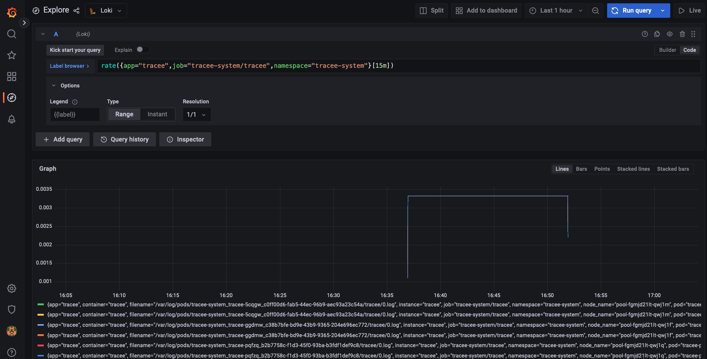

# Using Promtail, Loki and Grafana to access Tracee Logs

By default, Tracee is emitting events to stdout. Users can then configure logging solutions to collect, store, and manage Tracee logs. 

This tutorial will showcase how to install and configure Promtail, Loki, Grafana and Prometheus to then access Tracee logs from the cluster in Grafana.

If you prefer the video tutorial, check out the tutorial below on the Aqua Open Source YouTube channel:

 Grafana Loki to access Tracee logs 
  [](https://youtu.be/mMC9-yzbgpE?si=6C0emOEJJ5K4ACqB)


## Prerequisites

Please make sure to have the following tools installed in your CLI:

* Kubectl installed and connected to a Kubernetes cluster (any cluster will work for this purpose)
* The [Helm CLI](https://helm.sh/docs/) installed

Additionally, you might have the following Obserability Stack already installed in your cluster, if not we will detailed how to set it up further below in this guide: 

* [Prometheus](https://prometheus.io/)
* [Loki and Promtail](https://grafana.com/oss/loki/)
* [Grafana](https://grafana.com/oss/)

Alternatively, this tutorial showcases after the Tracee Installation section how to get an observability stack running with the above tools.

## Installing the Tracee Helm Chart and accessing logs

Right now, we cannot access any logs from our cluster since we do not have any application that actively produces logs.
Thus, we will install Tracee inside our cluster through the Tracee Helm Chart.

Add the Tracee Helm Chart:

```console
helm repo add aqua https://aquasecurity.github.io/helm-charts/
```

Update the repository list on Helm:

```console
helm repo update
```

Install the Tracee Helm Chart inside your Kubernetes cluster:

```console
helm install tracee aqua/tracee \
        --namespace tracee-system --create-namespace \
        --set hostPID=true
```

Now, ensure that Tracee is running inside the `tracee-system` namespace:

```console
kubectl get all -n tracee-system
```

Similar to Promtail, also for Tracee one pod should run on each node of the Kubernetes cluster.

### Accessing Tracee Logs

Generally, it is possible to access logs from the Tracee pods directly through kubectl:

```console
kubectl logs -f daemonset/tracee -n tracee-system
```

Next, open the Grafana Dashboard, on the left, go to "Explore". There, you should be able to select Loki as a Datasource.

Now, you can write log queries in LogQL to access the logs that are stored in the Tracee pods:



## Installation of Observability Tools

We need to install an observability stack to access the logs of the pods inside our cluster. This will consist of:
- Grafana (for Dashboards and querying logs)
- Promtail for collecting logs from the pods on each node
- Loki, which is feeding the logs inot Grafana

And since it is easier to install Grafana together with Prometheus, we are also going to install Prometheus.

If you are completely new to Loki, have a look at the following presentation:  [Learning the tricks of Grafana Loki for distributed logging at scale in a Kubernetes environment](https://youtu.be/jmtYUiBd_z0) 

### Grafana and Prometheus

First, we are going to install the kube-prometheus-stack chart with Prometheus and Grafana.

For this, we will need to specify some custom values that we will pass into the Helm Chart. 

Create a new file called `grafana-config.yaml` with the following content:

```yaml
prometheus:
  prometheusSpec:
    serviceMonitorSelectorNilUsesHelmValues: false
    serviceMonitorSelector: {}
    serviceMonitorNamespaceSelector: {}

grafana:
  sidecar:
    datasources:
      defaultDatasourceEnabled: true
  additionalDataSources:
    - name: Loki
      type: loki
      url: http://loki-loki-distributed-query-frontend.monitoring:3100
```

Next, we can install the kube-prometheus-stack chart into our cluster with the following commands:

Create a namespace for all the monitoring tools

```console
kubectl create ns monitoring
```

Add the kube-prometheus-stack Helm Chart to your Helm repository list:

```console
helm repo add prometheus-community https://prometheus-community.github.io/helm-charts
```

Ensure you have the latest version of all your repositories:

```console
helm repo update
```

Install the kube-prometheus-stack Helm Chart:

```console
helm upgrade --install prom prometheus-community/kube-prometheus-stack -n monitoring --values grafana-config.yaml
```

Lastly, confirm that all the pods have been created properly by querying the namespace:

```console
kubectl get all -n monitoring
```

### Promtail and Loki

Next, we need to install Promtail and Loki inside the cluster to actually access logs.

For this, first add the Grafana Helm Chart repository to you repository list:

```console
helm repo add grafana https://grafana.github.io/helm-charts
```

Update your Helm repository list:

```console
helm repo update
```

Next, create a file with the Helm Chart configuration for Prometail in a promtail-config.yaml:

```yaml
config:
  serverPort: 8080
  clients:
    - url: http://loki-loki-distributed-gateway/loki/api/v1/push
```

Now we can install the Promtail Helm Chart inside our cluster:

```console
helm upgrade --install promtail grafana/promtail --values promtail-config.yaml -n monitoring
```

Make sure that Promtail is running the same number of pods as there are nodes on the cluster since Promtail has to run one pod per node:

```console
k get pods -n monitoring
```

For instance, if the cluster consists of three nodes, then there should be three Promtails pods inside of the monitoring namespace.

Now, we can install Loki. Loki's job is to collect the logs from Promtail and forward them to Grafana.

```console
helm upgrade --install loki grafana/loki-distributed -n monitoring
```

Loki will install a variety of components inside your cluster, so don't be alarmed by the number of pods it is starting, namely:

```text
loki-loki-distributed-distributor-5db986bb4f-x444n
loki-loki-distributed-query-frontend-bd6845f89-z6nx6
loki-loki-distributed-gateway-79d4d4ff5d-sxx58
loki-loki-distributed-querier-0
loki-loki-distributed-ingester-0    
```

At this point, the following pods should be running inside the Kubernetes cluster:

```text
NAME                                                     READY   STATUS    RESTARTS      AGE
prom-prometheus-node-exporter-l4cm4                      1/1     Running   0             22m
prom-kube-prometheus-stack-operator-84cf966ff5-96xdp     1/1     Running   0             22m
prom-kube-state-metrics-dc769cd87-fmrsk                  1/1     Running   0             22m
prom-grafana-6fdb45b4d5-2zxw7                            3/3     Running   0             22m
alertmanager-prom-kube-prometheus-stack-alertmanager-0   2/2     Running   1 (22m ago)   22m
prometheus-prom-kube-prometheus-stack-prometheus-0       2/2     Running   0             22m
promtail-sxfl5                                           1/1     Running   0             4m7s
loki-loki-distributed-gateway-79d4d4ff5d-sxx58           1/1     Running   0             72s
loki-loki-distributed-distributor-5db986bb4f-x444n       1/1     Running   0             72s
loki-loki-distributed-query-frontend-bd6845f89-z6nx6     1/1     Running   0             72s
loki-loki-distributed-querier-0                          1/1     Running   0             72s
loki-loki-distributed-ingester-0                         1/1     Running   0             72s
```

Since everything is running properly, we need to ensure that we can access Loki as a data source inside of Grafana.

For this, port-forward to Grafana:

```console
kubectl port-forward service/prom-grafana -n monitoring 3000:80
```

and open the Grafana UI on localhost:3000.

Here, you will need the username and the password:
username: admin
password: prom-operator

The password name is dependent on how you called the Helm Chart installation of the kube-prometheus-stack chart e.g. in our case, it was "prom".

Now navigate on Grafana to: Explore 
Here select Loki as a data source.
